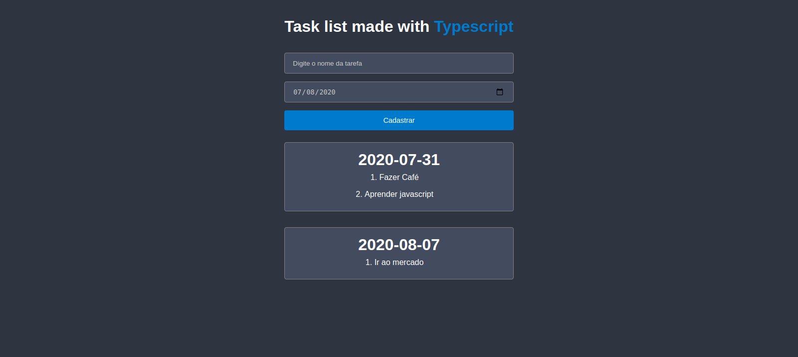

  

    To-do List com a possibilidade colocar o dia que a tarefa vai ser realizada.

  

## Tabela de conteúdos
   * [Sobre](#Sobre)  
   * [Tecnologias](#tecnologias)
   * [Como Contribuir](#contribuir)
   * [Licença](#licença)
   
<h2 id="Sobre">Sobre o Projeto</h2>
Projeto feito para práticar e aprender mais sobre o uso de typescript integrado com React.

<h2 id="tecnologias">Tecnologias</h2>

As seguintes ferramentas foram usadas na construção do projeto:

- [React](https://pt-br.reactjs.org/)
- [TypeScript](https://www.typescriptlang.org/)
- [Styled Components](https://styled-components.com/)

<h2 id="contribuir">Como contribuir</h2>

1. Faça um fork desse repositório;
1. Cria uma branch com a sua feature: `git checkout -b minha-feature`;
1. Faça commit das suas alterações: `git commit -m 'feat: Minha nova feature'`;
1. Faça push para a sua branch: `git push origin minha-feature`.

Depois que o merge da sua pull request for feito, você pode deletar a sua branch.

<h2 id="licença">Licença</h2>

Esse projeto está sob a licença MIT. Veja o arquivo [LICENSE](LICENSE.md) para mais detalhes.

